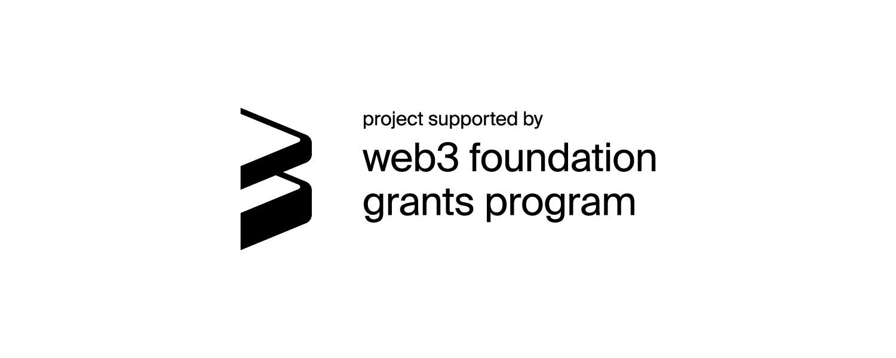

# Introduction

This is the official documentation for [Iris](https://github.com/ideal-lab5/iris), developed and maintained by [Ideal Labs](https://idealabs.network).

`This documentation and any information in it is subject to frequent and radical change as Iris is developed.`

Read our w3f grant proposal [here](https://github.com/w3f/Grants-Program/blob/master/applications/iris_followup.md)

## What is Iris?

Iris is a blockchain that enables a general purpose **decentralized data exchange**. It is infrastructure for the decentralized web, allowing for the development of decentralized applications where data sovereignty is preserved, data provenance is provable, and where decentralized governance and moderation without censorship is feasible. It is intended to enable transfer and monetization of access to and ownership of data across blockchains, smart contracts and participants in the network. 

## How does it work?

Iris functions by building a **cryptographically verifiable relationship** between data ownership, access, and availability. Data ownership is treated as an on-chain asset class, which allows for the fractionalization of ownership of digital assets. Through a rule based, smart contract approach, data access models are [programmable](./contracts/composable_access_rules.md) and fully transparent. The network implements a [secret sharing protocol](link here) that uses proxy reencryption and ECDH to provide security and ownership to your data. 

## Key Features

- Provable Data Ownership and Provenance
- Fractionalized Ownership of Digital Assets
- Smart Contract Support and Programmable Data Access Models
- Data Security using Encryption and Decryption with proxy reencryption and ECDH
- Transparent Data Governance and Moderation Capabilities

For a full breakdown of where we are in the implementation of these features, take a look at our [roadmap](./quickstart/development_status.md).

## Vision

We believe that decentralization of the web, tranisitioning from web2 to web3, is the optimal path moving forward, and that this ecosystem requires mechanisms to securely store, transport, and prove ownability, and that Iris provides the groundwork for a general decentralized data exhcange system. As such, we envision Iris as being a key enabler in a new class of decentralized applications that take advantage of provable data ownership and provenance to construct decentralized systems that fairly reward creators, consumers, and other participants in the system. We see Iris as providing a framework for inverting the present relationship between data creators and 'centralized platform providers', where rather than supplying data to a platform where the ownership is transferred, data creators are able to 'lease' their data to platforms or dapps using transparents governance, policies, and agreements.

## Contact

- twitter: https://twitter.com/ideal_labs
- website: https://idealabs.network/
- email: driemworks@idealabs.network
- discord: https://discord.gg/w8PF9MM6
- github: github.com/ideal-lab5
