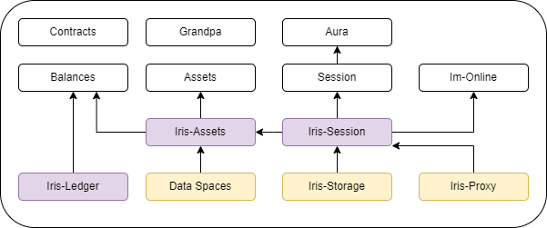

# Technical Overview

1. [Tech Stack](#tech-stack)
3. [Runtime](#the-iris-runtime)

## Tech Stack

### IPFS

Our integration with [rust-ipfs](https://github.com/rs-ipfs/rust-ipfs) is based on [prior work](https://rs-ipfs.github.io/offchain-ipfs-manual/introduction.html). The iridium-labs/substrate [offchain_ipfs_v3](https://github.com/iridium-labs/substrate/tree/offchain_ipfs_v3) branch maintained in sync with the latest substrate master.

The ui we provide relies on a local IPFS instance to add data (iris does not). To add data through the UI you must first run an instance of IPFS locally (you don't need to run an IPFS if you want read only access).

### Substrate

Substrate is a blockchain framework built by parity. It provides the building blocks for creating a blockchain, including the database, consensus, rpc, and much more.

### React

We use react to build the user interface to interact with our node. We specifically rely on the `polkadotjs` and `ipfs-http-core` libraries.

## The Iris Runtime

Iris functions by embedding an IPFS node within the substrate runtime and allowing substrate nodes to form a private IPFS swarm. By building a blockchain layer on top of the embedded storage, we are able to track calls and responses to IPFS on chain, allowing nodes to be rewarded for storing and retrieving data.

The Iris runtime builds from exsiting modules within the Substrate runtime, specifically the session and assets modules. In general, the Iris-Assets module, which depends on the assets modules, provides data ingestion, and asset class management. The Iris-Session module enables session based storage for content owner, where storage is provided by network validators. Read more on the Iris-assets and Iris-Session modules [here](./pallets.md).

There are four roles that nodes can take in Iris:

1. data owner
2. data consumer
3. validator
4. storage provider

Data owners are responsible for adding data to the Iris and creating, managing and minting asset classes and assets.

Data consumers are capable of retrieving data from Iris when they hold an asset minted from some owned asset class.

Iris is a PoA network, so validators are responsible for finalizing blocks.

Any validator is capable of being a storage provider. A storage provider is a validator that is actively storing some data associated with an owned asset class. Validators are incentivized to store data by earning reward points when they process IPFS requests or when data they are pinning is accessed.

Below, we see a high-level overview of how these four roles interact with one another. In the near future we intend to create a smart contract to realize an Iris Assets Exchange, a marketplace for data owners and data consumers to buy, sell, and share assets.

