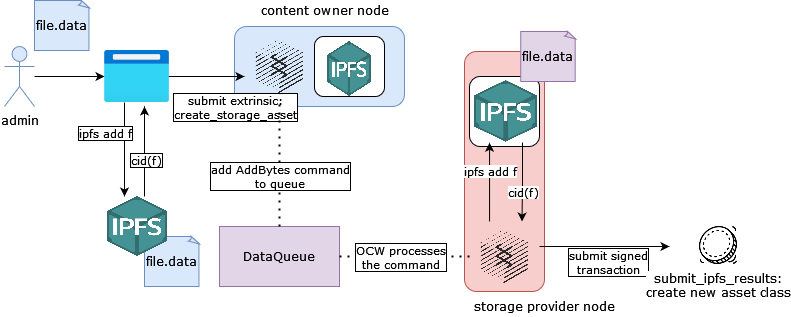
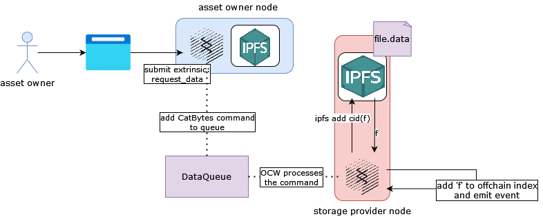

# Assets and Storage
 
In Iris, owned content is treated as a unique asset class and access to the content is controlled by ownership of assets minted from the asset class.

## The Ticket Asset Class
When a node adds data to Iris, the OCW that processes the request constructs a new asset class backed by some initial amount of native currency. (See the `create_storage_asset` [extrinsic](./chapter_3.md)). The results in a new `DataCommand` being added to the processing queue. When an OCW proceses the command and publishes results on chain, a new asset class is created. 

(read this from left to right)

Our initial use case makes assumptions that we will break in the future:

1. Each owner and CID combination has at most one associated asset class
2. Asset classes can correspond to at most one owner/CID combination
3. Owning a non-zero quantity of assets in an asset class grants the owner access to the underlying data

### Creating Tickets 
This is equivalent to granting access to some of your owned data to another node.

Only the admin node (i.e. content owner) is capable of minting new assets for an asset class. The admin specifies a `beneficiary` and the `amount` of assets to mint. (see: `mint_tokens` extrinsic).

### Accessing Data
Based on assumption three, owning a single asset of an asset class grants the owner access to the underlying data stored in IPFS. To retrieve data, a node makes a request to Iris, adding a request to retrieve bytes to the queue. An OCW processes the command and adds the fetched content to local offchain storage. The node which requested the data can then invoke the `iris_retrieveBytes` RPC endpoint exposed on the node who fetched the content in order to retrieve it. 

First, a node that owns some positive balance of an asset requests access to it:

Then the node calls the RPC endpoint:
