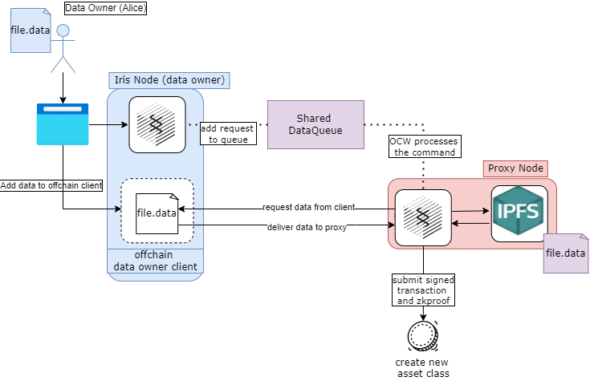
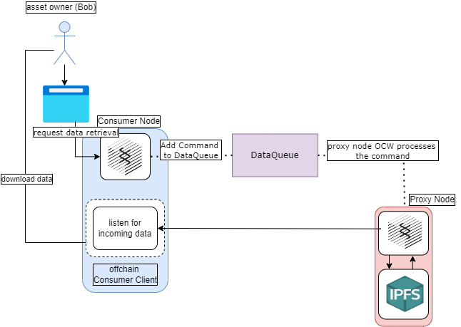

# Iris-Assets

The iris-assets module relies on the [assets module](https://github.com/paritytech/substrate/blob/master/frame/assets/README.md) available in Substrate. This pallet provides capabilities for content owners and content consumers. This module is entirely independent of IPFS. It provides capabilities to:

- inject data into the network
- create and manage data asset classes
- mint, transfer, and destroy assets

The iris-assets module delivers data asset class and data asset management. This module appends commands to a DataQueue which are processed by validator nodes (see the [iris-session](./pallets_iris_session.md) module for more info) in a module which implements logic for offchain workers to process commands in the DataQueue (in our case, the iris-session pallet).

## Runtime Details

### Extrinsics

Functions to inject data into the network and to create and manage asset classes and assets

- `create`
- `mint`
- `burn`
- `destroy`
- `transfer_asset`

Functions that allow offchain workers to submit results from IPFS commands

- `submit_ipfs_add_results`

### RPC

The iris-assets pallet contains the implementation of the RPC endpoint which fetches dat from the network. See more details [here](./rpc.md). The current implementation of this RPC endpoint will change drastically as we enter the next phase of development.

### Data Ownership as Asset Class Ownership

When a node adds data to Iris, the OCW that processes the request constructs a new asset class backed by some initial (user defined) amount of native currency. This results in a new `DataCommand` being added to the processing queue. When an OCW proceses the command and publishes results on chain, a new asset class is created. Asset creation and access is initiated in the iris-assets pallet but processed in the iris-session pallet.

Our initial use case makes assumptions that we will break in the future:

1. There is an injective and surjective map between owner/cid and asset class.
2. Owning any non-zero quantity of assets in an asset class grants the owner access to the underlying data

### Accessing Data Via Minted Assets

*Disclaimer: The current approach that iris takes for retrieving data will undergo significant changes in the next phase of development.*

#### The current approach

To retrieve data, a node makes a request to Iris, adding a request to retrieve bytes to the queue. An OCW processes the command and adds the fetched content to local offchain storage. The node which requested the data can then invoke the `iris_retrieveBytes` RPC endpoint exposed on the node who fetched the content in order to retrieve it.

First, a node that owns some positive balance of an asset requests access to it. When this request is processed by the calling node's OCW, the OCW stores the data in offchain storage. When the RPC endpoint is invoked, the data is returned to the authorized caller in the response.

#### The next-phase approach

In the next phase of development, we will use the [offchain client](../quickstart/offchain_client.md) to retrieve data from the network, where a proxy node will stream the data to an authorized user. Additionally, composable access rules will be executed each time a node requests data from the network.

