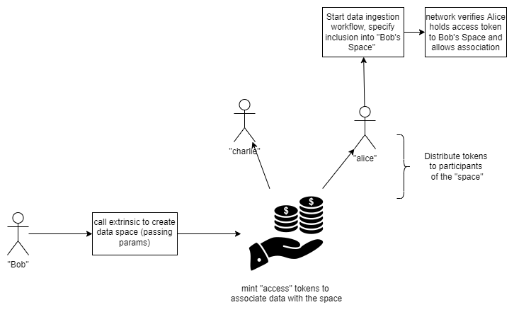

# Data Spaces

## What is a data space?

A data space is a user created and owned 'space' that data can be associated with. Data spaces allows nodes to group together disparate data sets based on ownership of the data asset classes that the data is associated with. A data space allows the owner to specify which nodes are authorized to associate data with their space. Data spaces form the basis for moderation within the network.

For example, a dapp developer may want all data added to iris that should be associated with their application to be both easily found within Iris and also subject to additional checks specific to their application, such as only allowing certain types of file extensions or moderating data in some specific way (more on this in the moderation and governance section). By creating their own data space, the owner can authorize users of their dapp to associate data with the space.

## Creating a Data Space

A data space is really an asset class mapped to a set of configuration items.

## Granting access

To grant access to your data space to another address in the network, mint new assets from the asset class and assign them to the given address. This can be done in several different ways with varying degress of control over how the holder of the asset can associate their own data assets the data space. In general, either the owner of the asset class can:

- lock transfers of the asset, meaning the holder cannot transfer it to any other accounts
- retain rights to revoke the asset, meaning the data space administrator can block previously authorized users

