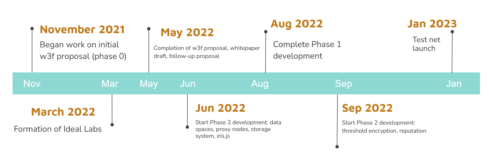

# Development Status

We plan to approach development over four distinct phase in order to iteratively implement Iris.

## Roadmap

## Phases

Here we detail the phases and explain where we currently are. The final intended state is as outline in our whitepaper draft, available at: [www.idealabs.network/docs](https://www.idealabs.network/docs)

### Phase 0

**COMPLETE**

Phase 0 delivered the basis of the iris blockchain, as detailed in the original [Iris grant proposal](https://github.com/w3f/Grants-Program/blob/master/applications/iris.md). Specifically, it delivered the mechanism for creating a cryptographic relationship between ownership, storage, and access. In a way, this can be thought of as a semi-decentralized (since it is a PoA network) IPFS pinnings service with an ownerhsip layer built on top of it. Further, this initial phase delivered the ability to use smart contracts to interact with the Iris runtime (via a chain extension). For more in depth details ,see the grant proposal. This phase also delivered a simple react-based user interface built on top of polkadotjs.

### Phase 1

**IN PROGRESS**

We intend to complete this phase by Q3 2022.

This phase, which is currently undergoing review by the w3f grants team, builds on the initial phase to set Iris up for long term success.

The intention of this phase is to implement several features that enable Iris to be a secure, social, and highly-available storage network without compromising decentralization. In our system, data owners associate their data with any number of 'data spaces' which each have specific rule sets and inclusion policies. We also lay the foundations for our encryption scheme (we will use a threshold encryption mechanism, though the implementation of this is out of scope for this proposal) by introducing the concept of the proxy node which will act as the linchpin for re-encryption in the future, as well as allows data owners and data consumers to run light clients (as they no longer are required to run the full node and add data to the embedded IPFS node). We also introduce a game-theoretic framework for ensuring replication and availability of data within the storage layer of Iris. Additionally we introduce "composable access rules", which allow data owners to specify rules which are implicitly enforced when consumers access their data. Lastly, we will build a javascript SDK to allow user interfaces for dapps built on Iris to easily build applications and interface with Iris.

To summarize, in the following we propose:

- the introduction of "data spaces"
- the implementation of "composable access rules" to apply custom business logic to data
- the introduction of "proxy nodes" that enable threshold encryption within the network
- the implementation of an availability-encouraging storage system
- a javascript SDK to allow dapp developers to easily build front ends for smart contracts on Iris, iris.js

### Phase 2

Phase 2 will enable:

- threshold encryption
- anonymous repoutation system

### Phase 3

Phase 4 enables moderation and curation within Iris. We expect that we can go live prior to the completion of this phase.
