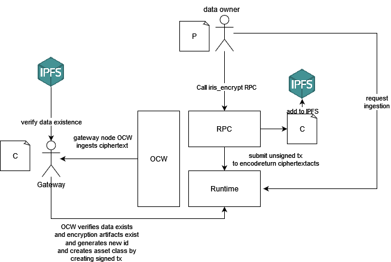
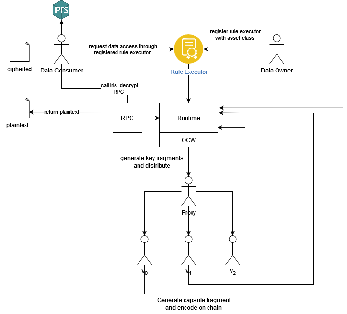

# Iris: A decentralized data sharing network

The Iris blockchain implements the Iris protocol, which uses threshold proxy reencryption (TPRE) and elliptic curve Diffie-Hellman (ECDH) to secure data and delegate decryption rights to authorized nodes. What that means is a data owner can encrypt their data one time and deploy a contract that specifies conditions that must be met in order to be granted decryption rights (e.g. some number of tokens must be transferred), and data consumers who meet those conditions can authorized to decrypt and download the data with no interaction from the data owner. This is made possible through the TPRE system (umbral pre), wherein Iris validator nodes are made responsible for processing requests to reencrypt data for consumers when requested.

## Data Assets

In the context of Iris, an **asset class** is an owned 'class' that is able to mint **assets** from that class and distribute them to peers. At the bare minimum, each asset class has an owner and metadata, which defines an identifier, along with functionality to mint assets. Each asset class has an additional property, `supply`, which is the total number of assets minted from the class. For those familiar with EVM based smart contracts, asset classes behave similarly to an ERC20 contract, with coins minted by the ERC20 being synonymous with those minted from the asset class.

Taking this one step further, we introduce the concept of a `data asset class`, which Iris uses to verify existence, ownership, and accessibility of data. A data asset class is an asset class mapped to a set of metadata which identifies some ciphertext, based on a [CID](../glossary.md#cid), which has been verified as having been both properly encrypted and able to be decrypted by parties when they are authorized. In our network, data asset classes are (almost) never directly created by a data owner, but on their behalf by a 'gateway' node. The data asset class ties together data ingestion, encryption, and authorization into a cohesive cryptographically verifiable onchain entity. Further, it enables the fractionalization of data ownership (and fractionalization of rewards), the programmability of data access models, and more.

## Adding data and Creating Asset Classes

Data asset class creation is always preceded by data encryption, ciphertext ingestion, and finally gateway node ingestion and verification. Our data ingestion design relies on two new types of nodes: the proxy node, to enable the TPRE system, and the gateway node, which facilitates secure data ingestion and data asset class creation. Both types of nodes are required to be validator nodes prior to taking on one of these roles. In the diagram below, RPC represents the RPC endpoints exposed by an Iris node and OCW is the node's offchain worker.

Fig 1. Ingestion and Asset class creation

In the figure above, you see a high level overview of how data encryption and ingestion functions. A potential 'data owner' invokes an RPC endpoint, iris_encrypt exposed by Iris to encrypt their data. Specifically, the endpoint accepts a signed message, signature, and signer account id, along with the plaintext to be encrypted and a proxy node's account id. In the present version of the network, any node who declares themselves as a proxy must accept any and all requests sent to it (in the next iteration of Iris, this will not be economically viable). The endpoint will verify the signature to recover the account id, then generate new keys, encrypt the plaintext, submit an unsigned transaction to submit encryption artifacts on-chain and finally, it returns the ciphertext to the caller. This process is more finely detailed in the Iris protocol [whitepaper](https://github.com/ideal-lab5/whitepaper/blob/main/IRIS_PROTOCOL_DRAFT_0.0.1.pdf). After adding the ciphertext to an IPFS node that's reachable by a gateway node, the data owner then calls an extrinsic to request that a gateway node verify the existence of their data and create a new data asset class on their behalf.

### Data Access Authorization

To make the process both non-interactive and transparent, we have exposed functionality through a chain extension that allows smart contracts to call into the Iris runtime to dictate if a node is or is not authorized to access some data. This is accomplished through the 'Authorization' pallet that exists as part of our runtime. 

## Provisioning data access

To provision access to data, an owner of a data asset class mints new assets from the asset class and registers an account id who is authorized to grant users access to data. This account id could potentially be yourself or another node, but to make the process non-interactive, predictable, and transparent, we have exposed functionality that allows smart contracts on Iris to be able to submit extrinsics that allow or deny access to callers (through the chain extension). We refer to contracts such as these as 'rule executors'. So the first step is for the data owner to register such a contract and for the data consumer to request access to data by calling some function in the contract that calls into Iris to authorize the user. 
If the consumer is authorized, a new request will be encoded onchain to reencrypt the data for the consumer. The proxy node (defined on ingestion) generates new key fragments (see the Iris protocol paper) and distributes them to three randomly-chosen validator nodes (note: the number 'three' here is arbitrary, and we used three only because our testnet is small. This number could potentially scale with the number of validators available.). Once key fragments are distributed, each selected validator generates a new capsule fragment and encodes it on chain. Finally, the consumer can gather two (again, arbitrary) capsule fragments, and the reencryption key, and finally decrypt the data and download it. 

And with this, the data has been successfully exchanged from the original data owner to a data consumer who met all of the rules set by the owner.

# Data Spaces

## What is a data space?

A data space is a user created and owned 'space' that data can be associated with. Data spaces allows nodes to group together disparate data sets based on ownership of the data asset classes that the data is associated with. A data space allows the owner to specify which nodes are authorized to associate data with their space. Data spaces form the basis for moderation within the network. You can think of it like a DAO, where membership to the DAO (owning an NFT) allows you to associate your data with it. Or in other terms, a 'Dataspace' is like a directory the is read-only for all users unless they have special write permission.

For example, a dapp developer may want all data added to iris that should be associated with their application to be both easily found within Iris and also subject to additional checks specific to their application, such as only allowing certain types of file extensions or moderating data in some specific way (more on this in the moderation and governance section). By creating their own data space, the owner can authorize users of their dapp to associate data with the space.

## The Role of Dataspaces

Dataspaces allow dapp developers to have a modicum of control of what types of data is available within their applications and allows them to only allows data that they want. In essence, it provides the framework for moderation without censorship in a decentralized way. For example, suppose that you want to develop a decentralized marketplace to buy and sell the rights to music. Most likely, you would specifically only want files to be included in your marketplace if they are in specific formats for audio files (e.g. .mp3, .wav, etc). By creating a new dataspace, tokens can be minted and distributed to trusted nodes who must agree to the rules of the dataspace (e.g. only associating data with the given extension). If the rules are not followed, the node can be punished or access revoked, as per the rules of the dataspace. Presently, we have not yet designed or implemented the moderation or rule definition for dataspace members, however it will be part of the next iteration of Iris. 

## Creating a Data Space

A data space is really an asset class mapped to a set of configuration items. The creation of a dataspace is the creation of a new asset class and an entry in the 'Dataspaces' storage map, which maps the dataspace id to the dataspaces metadata, which is just the name of the dataspace currently. 

## Granting access

To grant access to your data space to another address in the network, mint new assets from the asset class and assign them to the given address. This can be done in several different ways with varying degress of control over how the holder of the asset can associate their own data assets the data space. In general, either the owner of the asset class can:

- lock transfers of the asset, meaning the holder cannot transfer it to any other accounts
- retain rights to revoke the asset, meaning the data space administrator can block previously authorized users

