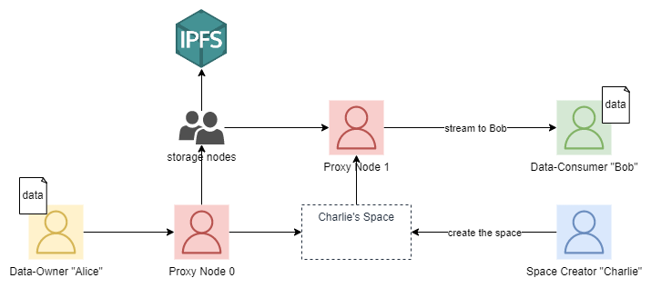

# Proxy

Proxy nodes form the basis for ingestion and ejection of data from the Iris network. The act both as a gateway, which proxies calls to IPFS for data owners and data consumers, as well as power the threshold encryption that will be added to Iris in the future.

## Becoming a Proxy Node

Becoming a proxy node functions similarly to becoming a validator node in a proof of stake consensus system. Additionally, proxy nodes must meet minimum hardware requirements. We enforce that they must both:

- run an intel processor (6th gen or greater) so that they can use intel SGX (this could possibly not be needed)
- have minimum bandwidth of 50 mbps up/down

As proxy nodes ultimately determine the bandwidth of the network, we require 50mbps to ensure an acceptable minimum network bandwidth.

## Proxy node rewards

Each time a node requests data ingestion and ejection to the network they are charged an additional transaction fee which will be used to reward proxy nodes.
