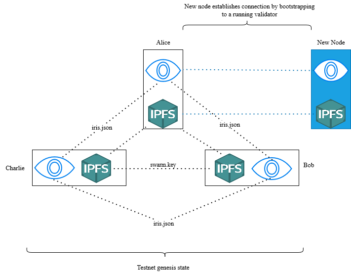

# Technical Overview

This is a brief overview of the core technologies used by the Iris blockchain.

## Tech Stack

### Substrate

Iris is built using the substrate framework. Substrate is a blockchain framework built by parity. It provides the building blocks for creating a blockchain, including the database, consensus, rpc, and much more. Additionally, it also provides the opportunity to connect to a rely chain, allowing for Iris to be leveraged in the context of other blockchains. See [here](https://docs.substrate.io/) for more information on the substrate framework.

### IPFS

Iris uses kubo (previously go-ipfs) for our 'hot' storage system. IPFS is a distributed peer-to-peer file sharing tool. As opposed to a location based addresssing system (e.g. fetching data from a server by passing the server's address and file location on the server), IPFS uses a content identifier (CID) based approach. Each unique sequence of bytes is assigned a unique CID, which Iris uses to associate data with asset identifiers. See [here](https://ipfs.tech/) for more information on IPFS.

### React

We use react to build the user interface to interact with our node. We specifically rely on the `polkadotjs` and `ipfs-http-core` libraries.

### High Level Network Architecture

Iris has a dual network topology. At one layer, the Iris nodes form an IPFS network, and at the other the Iris nodes themselves form a second network. As an example, our initial test network uses an architeture like the one below:

